## 51单片机自动避障小车

[TOC]

### 预实现功能：

1、车子使用蓝牙串口模块与手机或者电脑通信，手机或电脑控制小车移动；

2、当小车在移动过程中车的四路避障传感器检测到障碍物时，蓝牙无法控制小车，由小车自己根据传感器测得的数据自动实现避障；

3、当小车在前进的过程中遇到障碍物时，由舵机转动超声波模块分别测前方、左方右方45°90°障碍物距离自己的距离，并将这个距离发送给手机或电脑，显示在七段数码管上，小车根据距离选择一个可以通行的方向移动，当小车的传感器检测不到数据时，车子的控制权交给蓝牙；

4、小车被蓝牙控制、小车自己控制和小车停下时有对应指示灯亮；

5、实现小车转弯时速度减慢和调速？

### 材料清单

#### STC89C52RC

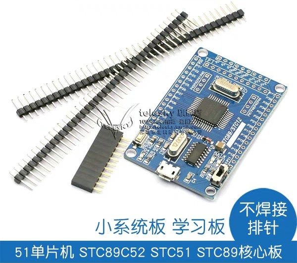

#### BT08蓝牙串口模块（更推荐HC06）

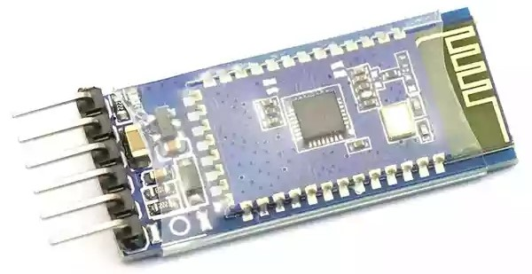

**TB6612FNG电机驱动板** x2

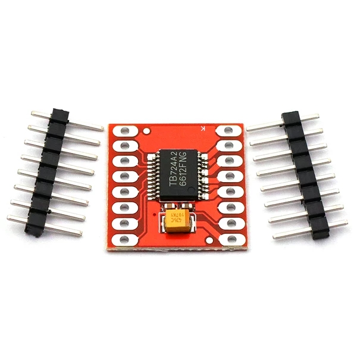

#### 红外避障模块x4

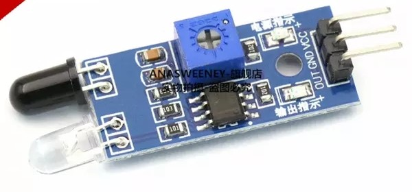

#### 智能小车底盘

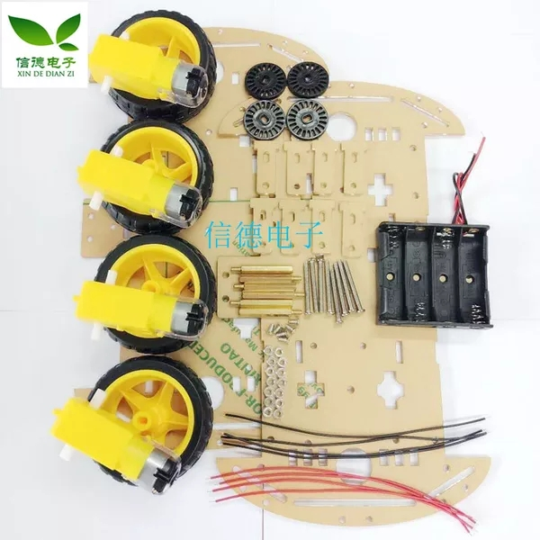

#### SG90 9g舵机及舵机支架

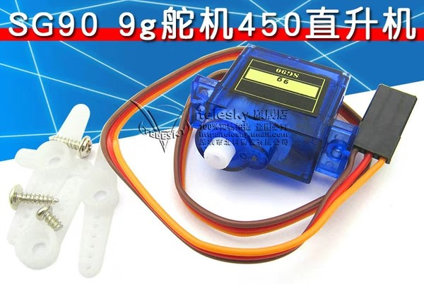

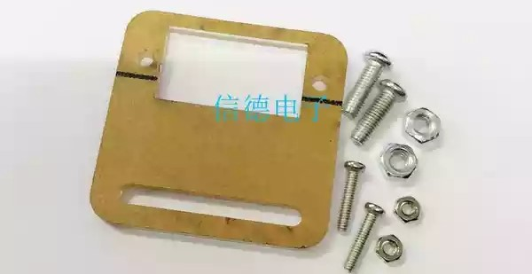

#### HC-SR04超声波模块及其支架

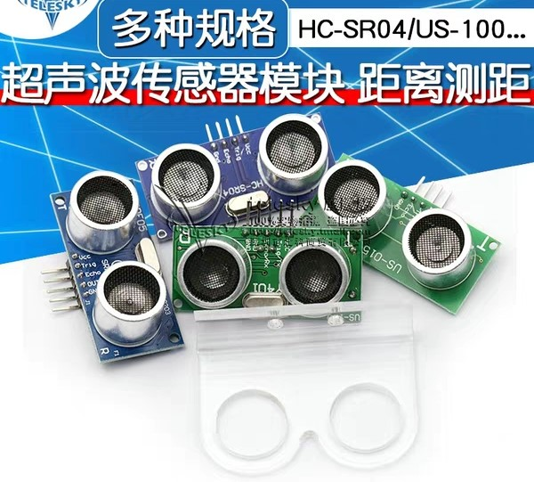

#### 数显电压表

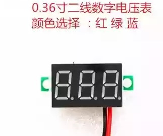

#### 3A降压板

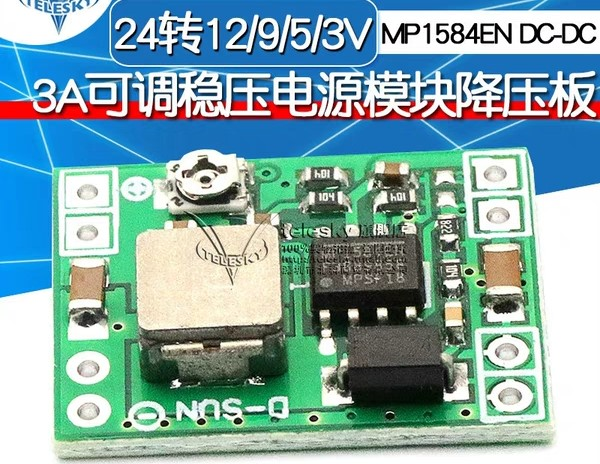

#### 万用板

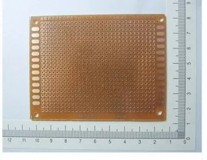

#### 10K欧排阻

P0口上拉电阻

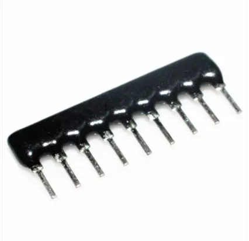

#### 铜柱，3mm螺丝帽，3mm螺丝

#### 其他

18650电池x2、18650电池仓、杜邦线21cm、10cm、排针、排母、共阳七段数码管、LED灯、万用表。

### 控制端代码

用python写的控制小车移动在终端中运行的一段代码，第一次真正意义上自己用python写东西，代码水平很烂。但python真的很厉害，要是换java或者C#，几十行代码肯定是搞不定。

