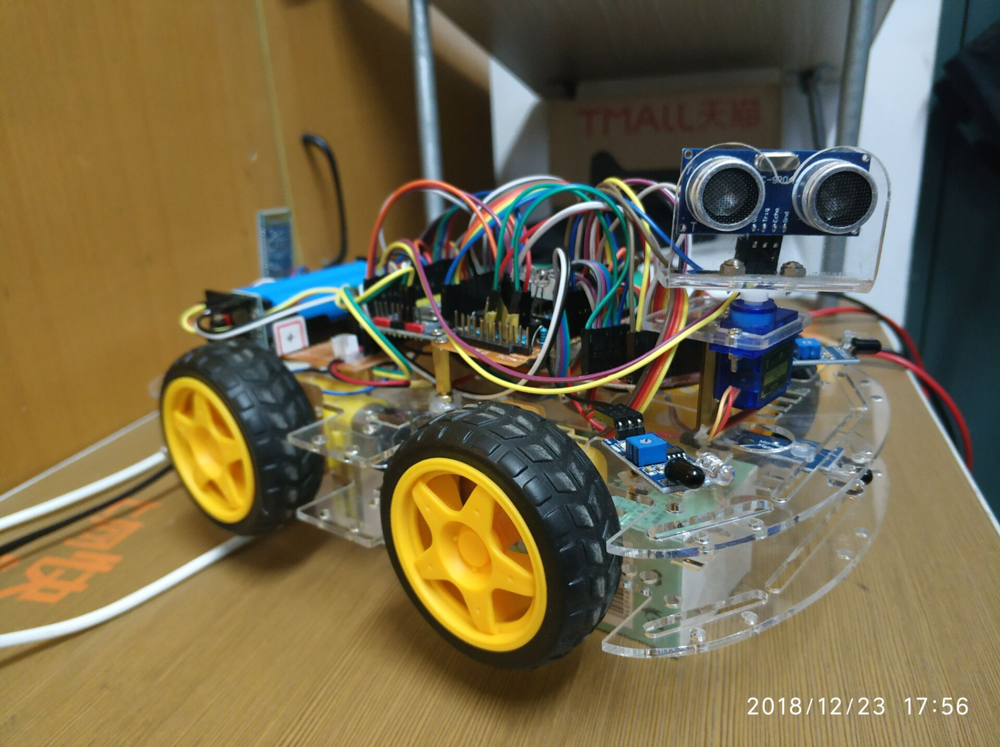

## 51单片机自动避障小车

[TOC]

### 预实现功能：

1、车子使用蓝牙串口模块与手机或者电脑通信，手机或电脑控制小车移动；

2、当小车在移动过程中车的四路避障传感器检测到障碍物时，蓝牙无法控制小车，由小车自己根据传感器测得的数据自动实现避障；

3、当小车在前进的过程中遇到障碍物时，由舵机转动超声波模块分别测前方、左方右方45°90°障碍物距离自己的距离，并将这个距离发送给手机或电脑，显示在七段数码管上，小车根据距离选择一个可以通行的方向移动，当小车的传感器检测不到数据时，车子的控制权交给蓝牙；

4、小车被蓝牙控制、小车自己控制和小车停下时有对应指示灯亮；

5、实现小车转弯时速度减慢和调速？

### 材料清单

#### STC89C52RC

#### BT08蓝牙串口模块（更推荐HC06）

**TB6612FNG电机驱动板** x2

#### 红外避障模块x4

#### 智能小车底盘

#### SG90 9g舵机及舵机支架

#### HC-SR04超声波模块及其支架

#### 数显电压表

#### 3A降压板

#### 万用板

#### 10K欧排阻

P0口上拉电阻

#### 铜柱，3mm螺丝帽，3mm螺丝

#### 其他

18650电池x2、18650电池仓、杜邦线21cm、10cm、排针、排母、共阳七段数码管、LED灯、万用表。

### 控制端代码

用python写的控制小车移动在终端中运行的一段代码，第一次真正意义上自己用python写东西，代码水平很烂。但python真的很厉害，要是换java或者C#，几十行代码肯定是搞不定。

### 仿真图

### 实物图

### 功能实现

开发环境：windows 10 + SDCC + VS Code + STC ISP

由于SDCC可以做到跨平台，故选择了它作为本次课设的编辑环境，安装好SDCC后，只需在终端中使用

sdcc main.c及pachihx main.ihx > main.hex即可得到对应的16进制文件。

由于VS Code友好的代码提示能力，选择VS Code作为本次课设代码的编辑器可以大幅减少书写代码时间，提高效率。

#### **1）** **单片机驱动电机**

由于单片机的IO口电流输出太小，无法直接驱动电机，需要借助L298N或者其他芯片实现对电机的控制。一开始我选择的L298N mini模块，为了实现调速，通过单片机的 一个IO口输出PWM信号给一个MOS管模块以实现对L298N mini模块供电大小的调整，但是最后结果不是我想象的那样，MOS管输出的电压的确根据PWM占空比的改变而改变，但是一旦接到L298N mini模块上，这个电压就会降低到很低，导致电机无法转动。虽然直接在它的对电机控制的IN口上输入PWM信号也能达到调速，但是实现起来很是麻烦。

不喜欢传统L298N的大体积，由于TB6612FNG模块具有小体积，可承受大电流，低功耗，有专门的PWM输入口实现调速的优点，故选择了它。

#### **2**）车速调整

小车速度的控制的PWM信号发生应该是优先级最低的，蓝牙控制还是自己避障都应该可以打破这个中断，故选择了52单片机的定时器2用来产生车速控制的PWM信号。

通过设置一个全局变量作为车速控制PWM信号的占空比控制，在串口中断中对输入的命令进行判断来增加减少这个全局变量，以实现对PWM占空比的调整。

#### **3）** **蓝牙命令执行时间控制**

通过对T2中断次数的统计，当达到设定值时，关闭T2，并停止小车，将T2中断次数置0.这样，控制端就需要一直发送命令，否则就不能让小车一直运动。

#### 4）小车避障

目前实现避障方法是通过避障模块检测障碍物，当传感器检测到障碍物时，根据不同的传感器是否被触发让小车做出对应的动作。然后再启动舵机带动超声波模块测量对应方向的障碍物距离，并循环测量直至这个距离大于预设的值，且对应方向的传感器未被触发，则认为此方向上没有障碍物。接着做出对应躲避障碍物动作后退出自动控制。

#### 5） **超声波测距**

先给超声波模块提供一个 10uS 以上脉冲触发信号触发，再通过定时器对模块发送回来的高电平计时，根据这个高电平时间利用公式，音速 = 340m/s = 0.34m/ms = 0.00034m/us = 0.034cm/us，距离 = 高电平时间 * 音速 / 2计算距离。

#### **6**）舵机转动

舵机的转动位置是靠控制PWM信号的占空比来实现的，这个PWM信号的周期应该是5*0.5ms = 2.5ms，再控制占空比即可调节舵机转动角度。

1/5 ---- 逆90°

2/5 ---- 逆45°

3/5 ---- 水平（归位）

4/5 ---- 顺45°

5/5 ---- 逆90°

### 已知问题

1、避障模块的有效感应距离太短，导致存在无法及时避障的问题

解决：换用质量更好更靠谱的避障模块来测试避障功能的可行性；

2、  解决避障模块的灵敏度高时导致电机转动时引起避障模块触发

解决：电机驱动板和避障模块使用相同的供电导致的。让单独的5V电源对电机驱动板供电或许能解决这个问题。

